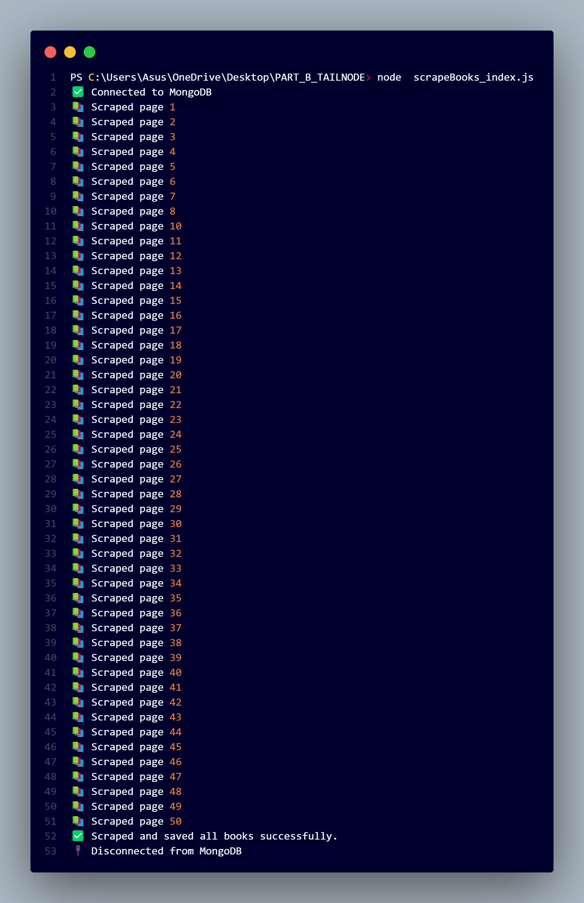

# Book Scraper and Database Saver

This Node.js script scrapes book information from a website and saves it to a MongoDB database. It utilizes Axios for making HTTP requests, Cheerio for parsing HTML, and Mongoose for database operations.
## Output


## OUTPUT VIDEO

Video Link:[](https://clipchamp.com/watch/Vj7ZpnUpTqF)


## Prerequisites

Before running the script, ensure you have the following prerequisites:

- Node.js installed on your system.
- MongoDB installed and running, and a MongoDB URI available.

## Installation

1. Clone this repository to your local machine:

   ```bash
   git clone https://github.com/your-username/your-repo.git
   cd your-repo


### 1.Install the required dependencies:

```bash
npm install axios cheerio mongoose dotenv
```

### 2.Create a .env file in the project root directory with the following content, replacing your-mongodb-uri with your actual MongoDB URI:

```bash
MONGODB_URI=your-mongodb-uri

```
## Usage
Run `node scrapeBooks_index.js ` in terminal or command prompt after installation of all packages is complete. The program will start scraping books from Goodreads website.

```bash
node scrapeBooks_index.js
```
Make sure to replace your-mongodb-uri with your actual MongoDB URI.

## Configuration

- Adjust `maxPages` in `scrapeBooks_index.js` to specify the number of pages to scrape.
- Customize the scraping logic in `scrapePage` to suit your needs, e.g., parsing different elements or websites.
- 
## File Structure

The project's file structure is organized as follows:

```bash
project-root/
│
├── scrapeBooks_index.js # The main script for scraping and saving book data.
├── models/
│ ├── book.js # Defines the Book model for MongoDB.
│
├── config/
│ ├── database.js # Database configuration, including Mongoose setup.
│
├── node_modules/ # Auto-generated by npm to store project dependencies.
│
├── .env # Configuration file for storing environment variables.
├── package.json # Defines project dependencies and scripts.
├── package-lock.json # Auto-generated file specifying exact versions of dependencies.
├── README.md # This README file.
├── LICENSE # License file (e.g., MIT License).
```
### Contributing
Contributions are welcome! Feel free to open issues or pull requests.

### License
This project is licensed under the MIT License - see the LICENSE file for details.
```bash

Your README is well-structured and provides all the necessary information in one code block. It looks good!

```
